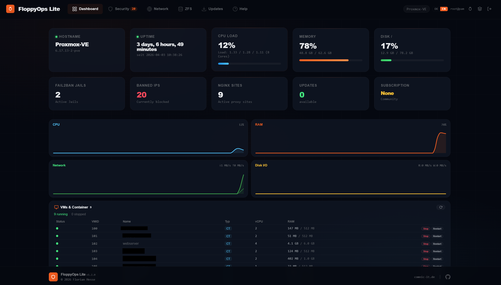
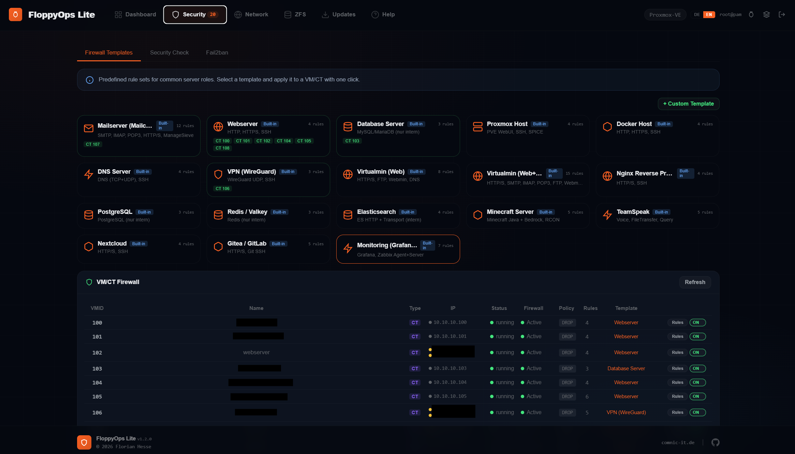
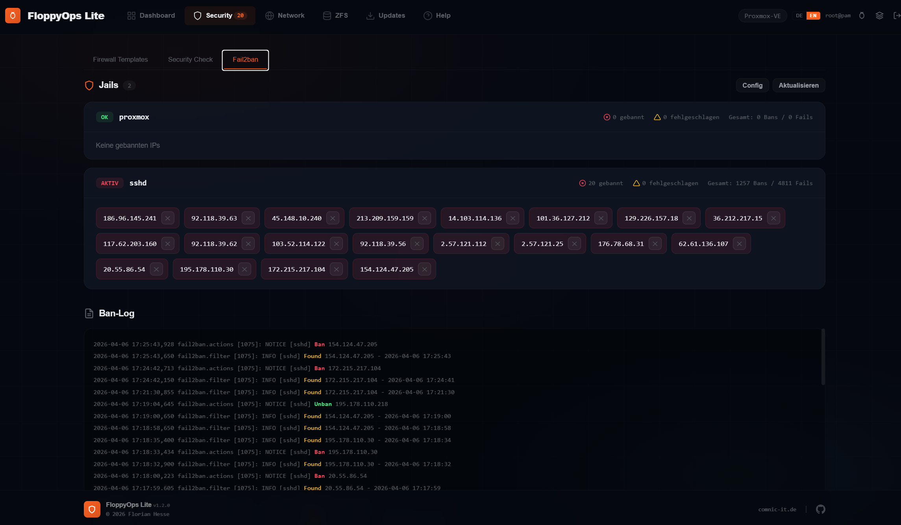
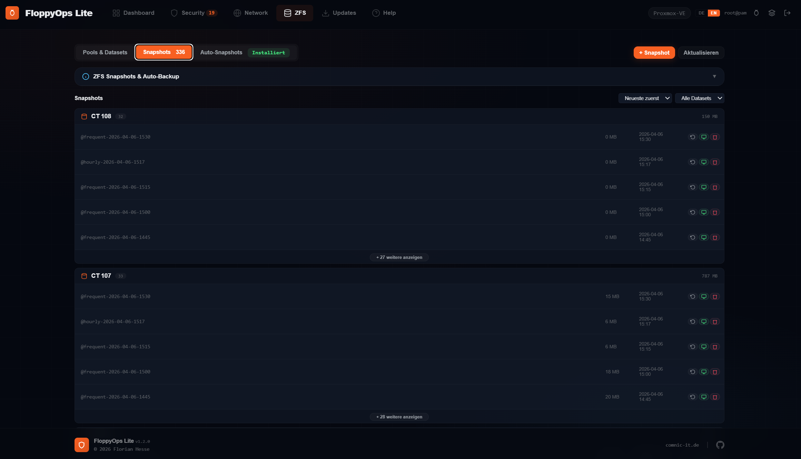
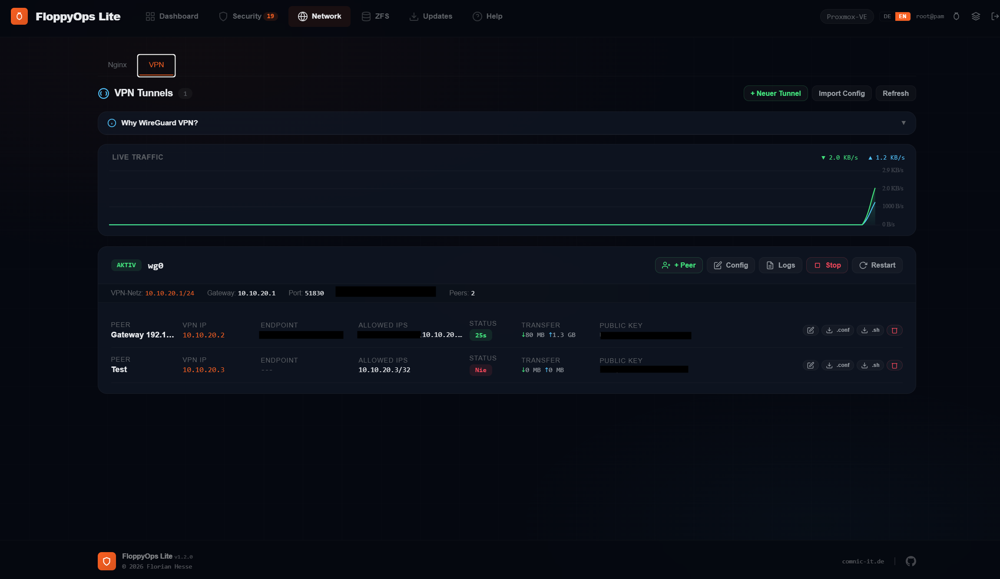
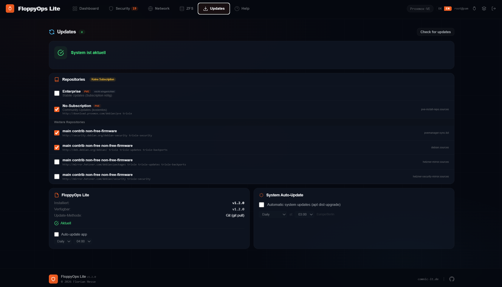

# FloppyOps Lite

**Open Source Server Admin Panel for Proxmox VE Dedicated Servers**

A lightweight, modern web panel installed directly on a PVE host. Built for rented dedicated servers (Hetzner, OVH, Netcup, etc.) running Proxmox VE — no cluster, no multi-server, just manage your single server.

   

<a id="english"></a>

**[Deutsch](#deutsch)** | **[English](#english)**



---

## Why FloppyOps Lite?

When you rent a dedicated server with Proxmox VE, certain tasks require terminal access:

- **Fail2ban** — Who is attacking my server? How many IPs are banned?
- **Nginx Reverse Proxy** — Multiple websites/apps on one server, each with its own domain and SSL
- **WireGuard VPN** — Secure access to internal CTs/VMs from anywhere, without exposing ports
- **ZFS Snapshots** — Automatic backups, rollback, clone containers in seconds
- **VM/CT Management** — Clone containers with custom hardware and network settings

FloppyOps Lite gives you all of this in a beautiful web interface — directly on your server, no external service needed.

## Features

### Dashboard
- Server status: Hostname, Uptime, CPU %, RAM, Disk
- **Live Charts** — CPU, RAM, Network I/O, Disk I/O (4s refresh, Chart.js)
- Fail2ban stats + Nginx site count + Updates count
- Auto-refresh every 4 seconds

### VMs & Containers
- Overview of all VMs and CTs (status, CPU, RAM, disk)
- **IP Column** — Shows IP addresses with colored dots: yellow = public IP, gray = internal IP
- **Template Assignments** — Shows which firewall template is assigned to each VM/CT
- **Clone** with Full/Linked Clone option
- Adjust hardware: CPU, RAM, Swap, Onboot
- Network: Keep, Customize (IPv4/IPv6 Address, Gateway, Bridge, DNS), or Disconnect
- Auto-start after clone

### Firewall Templates

- **18 built-in templates**: Mailcow, Webserver, Database, Proxmox, Docker, DNS, WireGuard, Virtualmin, Nginx Proxy, PostgreSQL, Redis, Elasticsearch, Minecraft, TeamSpeak, Nextcloud, Gitea/GitLab, Monitoring
- **Custom Templates** — Create, save and reuse your own rule sets
- **Editable rules** — Ports and sources can be customized before applying
- **Duplicate detection** — Already existing rules are not created twice
- **VM/CT Firewall Management** — View/toggle firewall per VM/CT, see status, policy, rule count and assigned template

### Fail2ban

- All jails with status (banned IPs, failed logins)
- **Unban** button per IP
- Config editor (jail.local) with save & restart
- Ban log viewer

### Nginx Reverse Proxy
- All proxy sites with domain, target, SSL status + expiry date
- **New site** creation with **CT/VM target picker** (auto-detects IPs from PVE) *(new in v1.2.0)*
- **DNS-01 Challenge** — SSL without port 80, supported providers: *(new in v1.2.0)*
  - **Cloudflare** (via certbot-dns-cloudflare)
  - **Hetzner DNS** (via certbot-dns-hetzner)
  - **IPv64.net** (via certbot manual hooks)
- **Progress modal** with live log for site creation and SSL renewal *(new in v1.2.0)*
- **Email field** for Let's Encrypt notifications *(new in v1.2.0)*
- Edit site (config editor) and delete (**certificate auto-cleanup** on deletion)
- **SSL Renew** button per site with progress log
- **SSL Health Check** — Automated check of all sites:
  - DNS A + AAAA record verification
  - SSL certificate validity and expiry
  - Certificate-domain match check
  - IPv4/IPv6 consistency (same certificate on both protocols)
  - **ipv6only=on detection** with 1-click fix
- **Cloudflare Proxy Support** — Optional during installation:
  - Automatic `real_ip` config for correct client IP behind CF Proxy
  - IP whitelists, logs and Fail2ban work correctly with proxied domains
- **Setup Guide** with live system checks:
  - IPv4/IPv6 Forwarding (with fix button)
  - IPv6 NDP Proxy check (with fix button)
  - NAT/Masquerading (with activate button)
  - Internal bridge detection
  - Nginx + Certbot status

### ZFS Storage

- **Pools & Datasets** — utilization, health, fragmentation
- **Snapshots** — grouped by CT/VM with name, sortable, filterable
  - **Rollback** — restore to previous state
  - **Clone** — create new CT/VM from snapshot (full hardware: CPU, RAM, Swap, Onboot + IPv4/IPv6 network customization)
  - Only 5 most recent shown, rest collapsible
- **Auto-Snapshots** — zfs-auto-snapshot installation + retention config
  - Per-dataset toggle
  - **Editable retention** per interval (frequent, hourly, daily, weekly, monthly)

### WireGuard VPN

- Tunnel status with peer info (endpoint, handshake, transfer)
- **Live traffic graph** (Chart.js, 5s interval)
- Config editor (real keys, no masking)
- Start / Stop / Restart per tunnel
- **New tunnel wizard** (3 steps):
  1. Basics: Interface, Port, IP, Keys (auto-generated)
  2. Peer: Endpoint, Public Key, Allowed IPs, PSK
  3. Preview + **Remote config for copying**
- **Firewall rules wizard**: NAT, Forwarding, IP-Forward as checkboxes

### Security Check
- **Port Scanner** — all listening ports with risk classification (critical/high/medium/low)
- External vs. local-only detection
- **PVE Firewall** — Datacenter + Node status, one-click enable (auto-adds SSH + WebUI safety rules)
- **Firewall Rules** — view, add (modal), delete existing rules
- **One-Click Block** — block risky ports (rpcbind, MySQL, Redis, etc.)
- **Default Rules** — apply recommended ruleset with selectable checkboxes

### Updates & Repositories

- **System Updates** — check + install (apt dist-upgrade) with one click
- **Repository Management** — Enterprise / No-Subscription repos with toggle switches
  - Auto-detect PVE 8 (bookworm) and PVE 9 (trixie, DEB822)
  - Subscription status display
- **App Self-Update** — version check against GitHub, one-click update
- **Auto-Update** — system + app auto-update with configurable schedule

### Authentication
- **Realm Selection** — Dropdown: Proxmox VE (PVE) or Linux (PAM)
- **PVE Auth** — Login with Proxmox VE users (root@pam, etc.)
- **PAM Auth** — Linux system users
- CSRF tokens on all forms
- Nginx IP whitelist template

### PVE Dashboard Integration
- **Toolbar Button** — FloppyOps button in PVE's top toolbar
- **SSL Access** — Port 8443 with PVE certificate, auto HTTP→HTTPS redirect
- **apt Hook** — auto-restores integration after PVE updates

### More
- Deutsch / English — language toggle in topbar
- Responsive layout (mobile-friendly)
- Dark theme with accent color — all assets bundled locally (no CDN)
- Tab persists after reload (URL hash)

## Installation

```bash
git clone https://github.com/floppy007/floppyops-lite.git
cd floppyops-lite
bash setup.sh --domain admin.example.com
```

### Options

```
--domain FQDN    Domain for the panel (enables SSL via Certbot)
--dir /path      Install directory (default: /var/www/server-admin)
--no-ssl         Skip SSL certificate
```

### Module Selection

The setup script asks which modules to install:
- **Fail2ban** — Brute-force protection + ban management
- **Nginx Proxy** — Reverse proxy + SSL (Let's Encrypt, Cloudflare DNS, Hetzner DNS, IPv64 DNS)
- **ZFS** — Pools, datasets, snapshots, auto-snapshots
- **WireGuard** — VPN tunnel management + wizard

### Requirements

- Proxmox VE 8+ on a dedicated server
- Root access
- PHP 8.x + PHP-FPM
- Nginx

## Architecture

```
index.php              → Complete app (API + Frontend)
config.php             → Credentials + settings (not in Git)
config.example.php     → Template for config.php
lang.php               → Translations (DE/EN)
setup.sh               → Automated setup script
js/                    → Modular JS (dashboard, vms, nginx, wireguard, zfs, ...)
js/chart.min.js        → Chart.js (bundled locally)
public/style.css       → Dark theme CSS
public/fonts/          → Outfit + JetBrains Mono (bundled locally)
views/                 → PHP view templates (dashboard, modals, tabs)
pve-integration/       → PVE toolbar button + install script
```

Single-file PHP app — no framework, no database, no external dependencies. All assets bundled locally.

## License

MIT License — free to use and modify.

**Footer attribution must remain** (see [LICENSE](LICENSE)).

---

<a id="deutsch"></a>

## Deutsch

### Warum FloppyOps Lite?

Wenn du einen Dedicated Server mit Proxmox VE mietest, fehlen dir einige Dinge die du normalerweise nur über das Terminal erledigen kannst:

- **Fail2ban** — Wer greift meinen Server an? Wie viele IPs sind gebannt?
- **Nginx Reverse Proxy** — Mehrere Webseiten/Apps auf einem Server, jede mit eigener Domain und SSL
- **WireGuard VPN** — Sicherer Zugriff auf interne CTs/VMs von überall, ohne Ports öffentlich freizugeben
- **ZFS Snapshots** — Automatische Sicherungen, Rollback, Clone von Containern
- **VM/CT Management** — Container und VMs clonen mit angepasster Hardware und Netzwerk

FloppyOps Lite gibt dir all das in einer schönen Web-Oberfläche — direkt auf deinem Server, kein externer Dienst nötig.

### Features

| Bereich | Funktionen |
|---------|-----------|
| **Dashboard** | Uptime, CPU, RAM, Disk, ZFS Pools, Fail2ban Stats, Nginx Sites, Live Charts |
| **VMs/CTs** | Übersicht, IP-Spalte (öffentlich/intern), Template-Zuweisung, Clone (Full/Linked), Hardware, Netzwerk (IPv4/IPv6) |
| **Firewall** | 18 Built-in Templates + Custom, editierbare Ports/Sources, Duplikat-Erkennung, VM/CT Firewall-Verwaltung |
| **Fail2ban** | Jails, gebannte IPs, Unban, Config-Editor, Ban-Log |
| **Nginx Proxy** | Sites, SSL (HTTP-01 + **DNS-01: Cloudflare, Hetzner DNS, IPv64.net**), CT/VM-Zielauswahl, **Fortschritts-Modal**, SSL Health Check, Cloudflare Proxy Support |
| **ZFS** | Pools, Datasets, Snapshots (gruppiert), Rollback, Clone, Auto-Snapshots |
| **WireGuard** | Status, Live Traffic Graph, Config, Tunnel-Wizard, Firewall-Wizard |
| **Security** | Port-Scanner, PVE Firewall, Regeln verwalten, One-Click Block, Standard-Regeln |
| **Updates** | System-Updates, Repository-Verwaltung, App Self-Update, Auto-Update |
| **Auth** | PVE/PAM Realm-Auswahl, CSRF, IP-Whitelist |
| **PVE Integration** | Toolbar-Button, SSL Port 8443, apt-Hook |
| **i18n** | Deutsch + Englisch |

### Installation

```bash
git clone https://github.com/floppy007/floppyops-lite.git
cd floppyops-lite
bash setup.sh --domain admin.example.com
```

Das Setup-Script fragt welche Module installiert werden sollen (Fail2ban, Nginx, ZFS, WireGuard).

### Voraussetzungen

- Proxmox VE 8+ auf einem Dedicated Server
- Root-Zugriff
- PHP 8.x + PHP-FPM
- Nginx

---

## Links

- **FloppyOps PVE Manager** (Full Version): [floppyops.com](https://floppyops.com)
- **Author**: Florian Hesse — [Comnic-IT](https://comnic-it.de)
